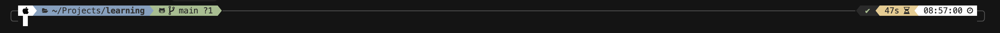

# Laptop setup

Here is how I like to setup my laptop.

Design goals:

- **Simple**. Simpler is better. Easier to remember where things are and how to do tasks. Fewer things to break.
- **Minimal**. By carrying fewer things, it's easier to keep things tidy and running efficiently. Delete or disable unnecessary stuff. Less to manage and upgrade.
- **Offload important stuff to the cloud**. That way I can access it from multiple devices as needed. And migrating to a new laptop is easy as there is less to backup/restore.
- **Distraction free**. Disable notifications and anything that will interrupt me so that I can be more focused when I'm working on a project.
- **Snappy and efficient**. Favor tools that are fast and efficient over those that are slow and bloated. There's something satisfying about a snappy experience, and it helps to stay in the flow of your tasks better when context switching is instantaneous.

## Hardware

- MacBook Air for portability
- Neoprene case (Incase or similar brand) to keep it safe for transport
- No stickers. I like it clean and stock.
- Accessories: extra power cable, USB C dongle with 2 HDMI outputs
- 2 external monitors (same brand, Sceptre 27" curved)
- Vivo dual monitor stand

## Software

- Safari as primary web browser
    - Bookmarks: Gmail, Google Calendar and Tasks.
    - Plugins: 1password
    - Enable Developer Tools
    - Disable Password auto-fill (use 1password for this)
- [1password](https://1password.com/downloads/mac) app for managing passwords, passkeys and secrets across devices
- [Spotify](https://www.spotify.com/us/download/mac/) for music
- [Stats](https://mac-stats.com) app for system stats. CPU %, RAM %, Battery showing time to discharge and %.
- [Rectangle](https://rectangleapp.com) app for keyboard shortcuts to move and resize windows. 
    - CTRL ˄ OPTION ⌥ RETURN ⏎ to maximize window
    - CTRL ˄ OPTION ⌥ LEFT ARROW ← to move window to left half of screen
    - CTRL ˄ OPTION ⌥ RIGHT ARROW → to move window to right half of screen
- [Obsidian](https://obsidian.md) for organizing my notes using Markdown in folders:
    - `Goals\` with a page for each year's goals. Each page is broken down by quarter and month with a simple `- [ ]` todo list to track accomplishment.
    - `Templates\` with a template for weekly plans with sections for `Goals` (work and personal), `Review` (accomplishments, things I learned), `Retrospective` (what's going well, things to improve), and `Notes`.
    - `Weekly Plans\` with a page for each week numbered `YYYY-MM-DD Weekly Plan`. 
    - `Projects\` with a page for each project.  A catch all `Ideas` page with bulleted list of potential project ideas.
- [Syncthing](https://syncthing.net) to sync `~/Sync/` folder between laptops locally. This is how I sync Obsidian workspaces with notes.

### Developer tools

- [Homebrew](https://brew.sh) for install software
- Shell: Zsh
- Terminal: [iTerm2](https://iterm2.com)
    - Configure iTerm2 → Preferences → Profiles → Text and set Font to `MesloLGS NF` after installing p10k prompt
- Prompt: [powerlevel10k](https://github.com/romkatv/powerlevel10k): `brew install powerlevel10k`
    - Configure [Nerd Font](https://github.com/romkatv/powerlevel10k?tab=readme-ov-file#fonts) automatically for `MesloLGS NF`.
    - Enable Instant Prompt
- Git: `brew install git`
- [Golang](https://go.dev): `brew install go`
- [uv](https://docs.astral.sh/uv/) for python virtualenv management: `brew install uv`
- [Sublime Text](https://www.sublimetext.com) as a very fast text editor. Mostly for basic text editing of YAML and config, not programming.
- [Cursor](https://cursor.com/home) as AI IDE, alternative to VS Code.
    - Configuration:
        - Cursor Settings > Models > Anthropic API key
        - VS Code Settings > Terminal Font set as `MesloLGS NF`
        - VS Code Settings > Theme > Cursor Dark
    - Plugins:
        - Github Pull Requests
        - GitLens
        - Go
        - Jupyter
        - Python
        - Python Debugger
        - Makefile Tools
        - YAML
        - Docker
- [Xcode](https://developer.apple.com/xcode/)
- [Docker Desktop](https://docs.docker.com/desktop/setup/install/mac-install/)
    - Configuration:
        - Disable auto-start on login I can launch only when needed
        - Enable Kubernetes
- [DBeaver](https://dbeaver.io) for database GUI: `brew install --cask dbeaver-community`
- [Claude Desktop](https://claude.ai/download)

### Tips

**Customized prompt**



**Fast terminal startup**

Silence the "last logged in" message when opening new terminal:

```sh
touch .hushlogin
```

Edit `~/.zshrc` to comment out everything except what's critical.

When installing powerlevel10k, enable "instant prompt".


**Organizing code**

```text
~/Projects
├── learning                    - github repository
└── some-app-backend-go         - github repository with a descriptive project name, a hint about the type of project (backend, cli, etc.) and which language or framework as applicable.
```

**Mac Settings**

- Appearance: Auto (light and dark mode)
- Dock hiding and magnification on
- Spotlight search for Applications, Developer, Documents, Folders and System Settings only.  Less to index, faster performance, better results.
- Disable notifications for most things.
- Location services off
